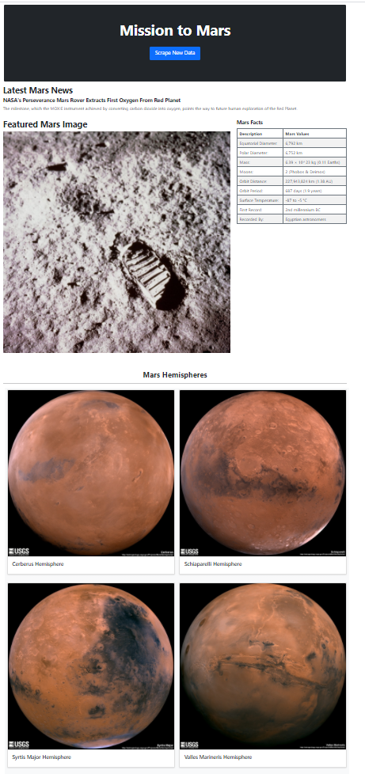

# Missions to Mars

## Step 1 - Scraping

Initial scraping using Jupyter Notebook, BeautifulSoup, Pandas, and Requests/Splinter.

* Scrape the [NASA Mars News Site](https://mars.nasa.gov/news/) and collect the latest News Title and Paragraph Text.
* Visit the url for JPL Featured Space Image [here](https://www.jpl.nasa.gov/spaceimages/?search=&category=Mars) and find the image url for the current Featured Mars Image.
* Visit the Mars Facts webpage [here](https://space-facts.com/mars/) and scrape the table containing facts about the planet including Diameter, Mass, etc.
* Visit the USGS Astrogeology site [here](https://astrogeology.usgs.gov/search/results?q=hemisphere+enhanced&k1=target&v1=Mars) to obtain high resolution images for each of Mar's hemispheres.

## Step 2 - MongoDB and Flask Application

Use MongoDB with Flask templating to create a new HTML page that displays all of the information that was scraped from the URLs.

* Created a Python script called `scrape_mars.py` with a function called `scrape` that will execute all of the scraping code and return one Python dictionary containing all of the scraped data.
* Created a route called `/scrape` that will import the `scrape_mars.py` script and call the `scrape` function. Store the return value in Mongo as a Python dictionary.
* Created a root route `/` that will query the Mongo database and pass the mars data into an HTML template to display the data.
* Created a template HTML file called `index.html` that will take the mars data dictionary and display all of the data in the appropriate HTML elements. The final product look like below.

## Copyright

Trilogy Education Services © 2020. All Rights Reserved.
